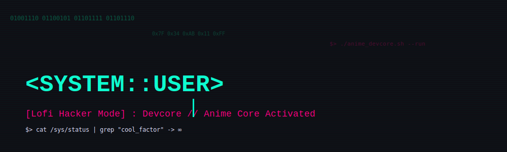

<div align="center">
  
  ## ⚡ SYSTEM STATUS: `ONLINE`
  
  
  
  
  
</div>

## 💻 DEV CORE STATUS

```yaml
USER: 
  name: "BuiltByLevi"
  role: "Software Engineer / Anime Dev"
  location: "Cyberspace 🌐"
  
CODING_STATS:
  current_mood: "Hyperfocus ✨"
  anime_watching: "Cyberpunk Edgerunners"
  playing: "Lo-fi Hip Hop Beats"
  
TECH_STACK:
  languages: [JavaScript, TypeScript, Python, Go]
  frontend: [React, Next.js, TailwindCSS]
  backend: [Node.js, FastAPI]
  tools: [Docker, Git, Neovim]
  
STATUS: "🟢 OPEN FOR COLLABS"
